FPGA Design Lab2 - Block Design and Debugger Set Up
===================

# Before the Lab

### What is IP ?

**Intellectual Property** : A functional black box, provided by Xilinx or other third-party providers.

Reference : [Wiki](https://zh.wikipedia.org/wiki/%E5%8D%8A%E5%AF%BC%E4%BD%93IP%E6%A0%B8) ,  [Xilinx](https://www.xilinx.com/products/intellectual-property.html)

# Part 1 - IP package

## Purpose

學習如何將自己的設計的電路打包成 IP 來進行模組化設計

## 1-1 Package IP - 1

在電腦選擇一個自己想要的路徑(不能有中文)，建立 IP 的資料夾  
**Note : 目的是為了方便管理自己 package 的 IP，資料夾名稱可自己取(必須為英文)。**

這次 Lab 要打包成 IP 的模組有兩個，分別為 `PWM_Decoder`、`RGB_LEDs`

首先我們打包第一個 IP

開啟一個 Vivado Project，並加入 `/src/RGB_LED.v` , `/xdc/RGB_LED_ooc.xdc`
接著照著步驟修改 `RGB_LED_ooc.xdc` 的 Properties

> Out-of-context 代表 IP 在接入 Top-level design 之前會事先進行合成  
> 而 Top-level design 會將這個 IP 視為一個 functional black box  

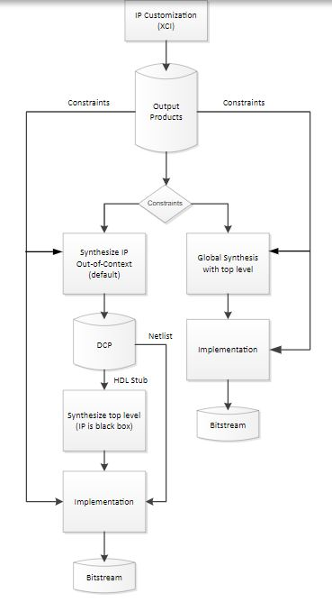

修改完 `RGB_LED_ooc.xdc` 的 Properties後，點選上方工具列 `Tools` -> `Create and Package New IP`

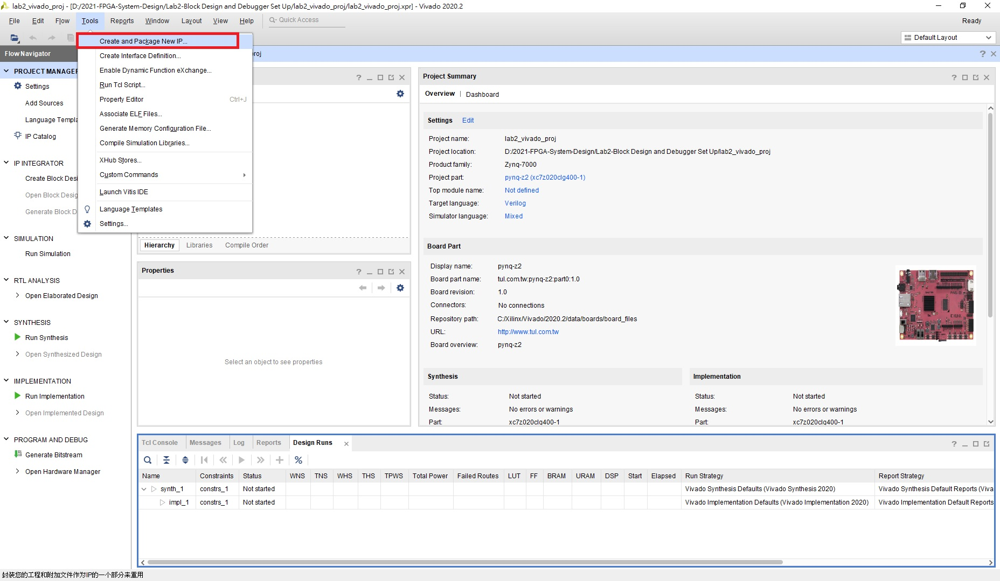

選擇剛剛 create 的 IP 資料夾路徑

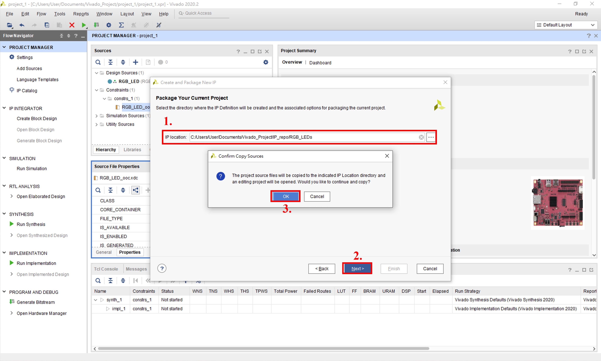

Finish 後會打開一個新的 IP project

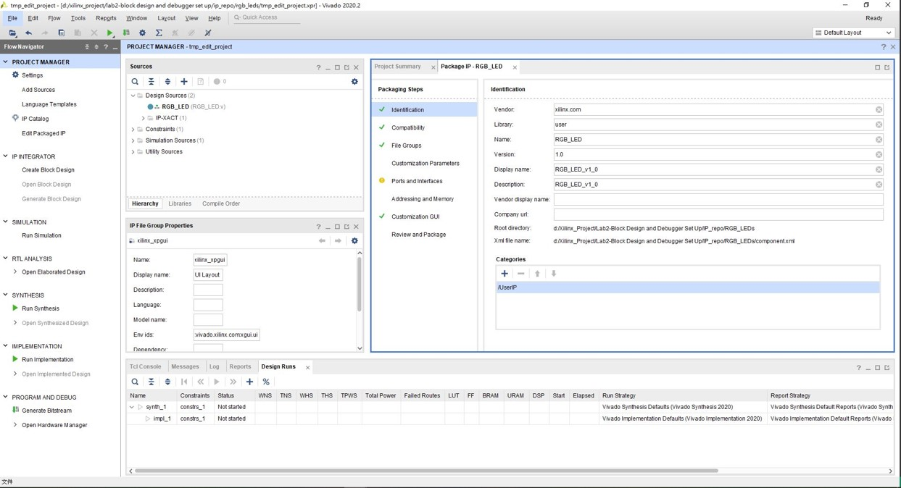

按照步驟點選，將電路打包成IP

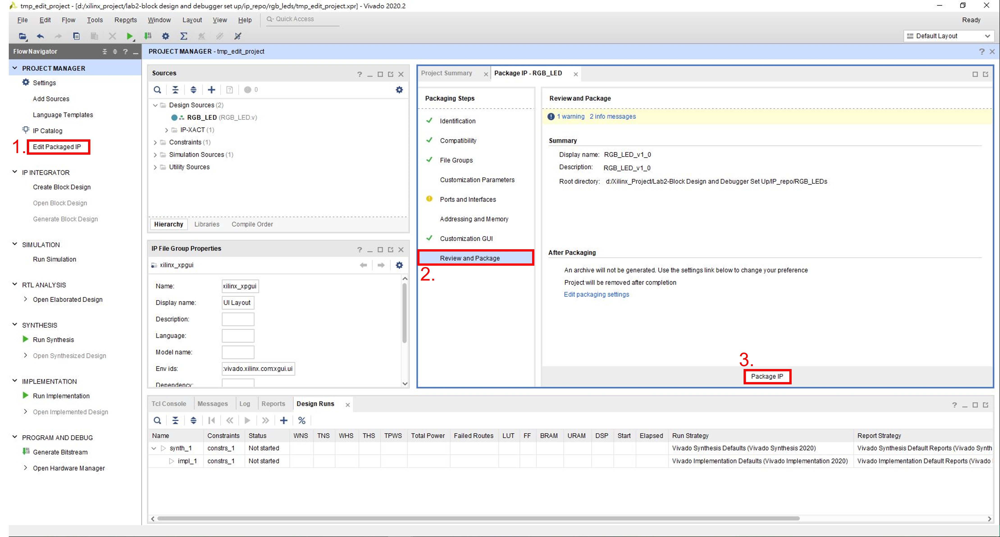

------

## 1-2 Package IP - 2

再開啟一個 Vivado Project，並只需加入 `/src/PWM_Decoder.v`

接著選上方工具列 `Tools` -> `Create and Package New IP`

和上一 Part 一樣打包成 IP。

-------
## 1-3 RTL code 呼叫 IP

開啟一個 Vivado Project，並加入 `/src/top.v` , `/xdc/pynq-z2_v1.0.xdc`

點選 `PROJECT MANAGER` > `setting` > `IP/Repository`

點選加號，選擇前兩個 Part 所製作的 IP 所在的資料夾，將剛剛製作的 IP 加入 IP Repository

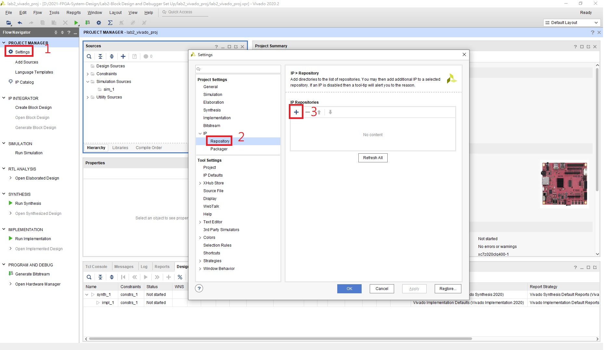

若剛剛有製作成功，選完資料夾路徑應該會看到偵測到兩個 IP 的畫面

接著點選 `PROJECT MANAGER` > `IP Catalog`，在 Search space 搜尋 RGE_LED 找到剛剛打包的 IP 並點選

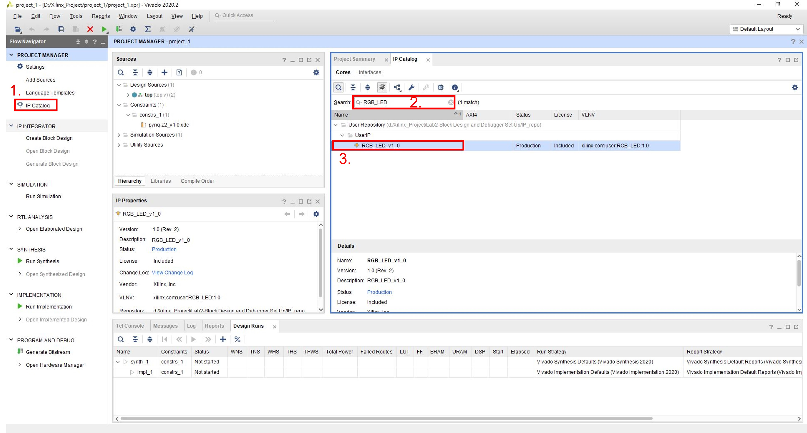

選擇 Out of context per IP，然後點選 Generate 來進行 IP 的合成

**依照上述的步驟將 PMW_Decoder IP 也呼叫進來**

可以在 Souce window 裡面打開 IP 的 `.v`檔，查看要在 top design 裡面要 instantiate IP module 的名稱

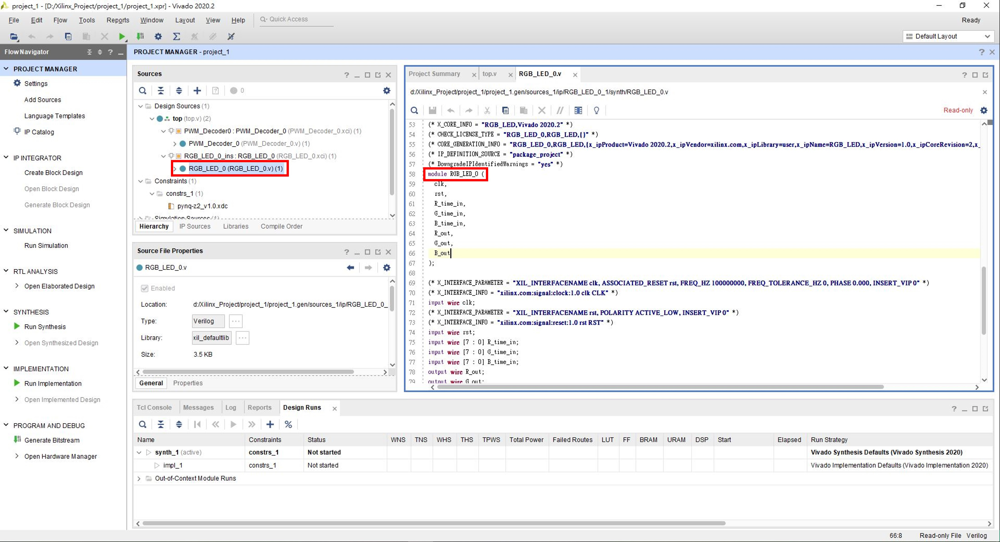

接著即可執行 `Synthesis` -> `Implementation` -> `Generate Bitstream`  
**(直接按下 `Generate Bitstream` 其實也會把前面兩步驟都一起做完)**

然後將 Bitstream file 燒錄進 FPGA。

------
# Part 2 - Block Design

先開啟一個 Vivado Project，不需加入任何檔案  
然後依照 **Part1: 1-3** 一開始的步驟，將製作的 IP 加入 IP Repository

選擇左方列 `Create Block Design`

選擇上方工具列的`+` (或是在空白處`右鍵` -> `Add IP`)，加入前兩個步驟建立的 IP

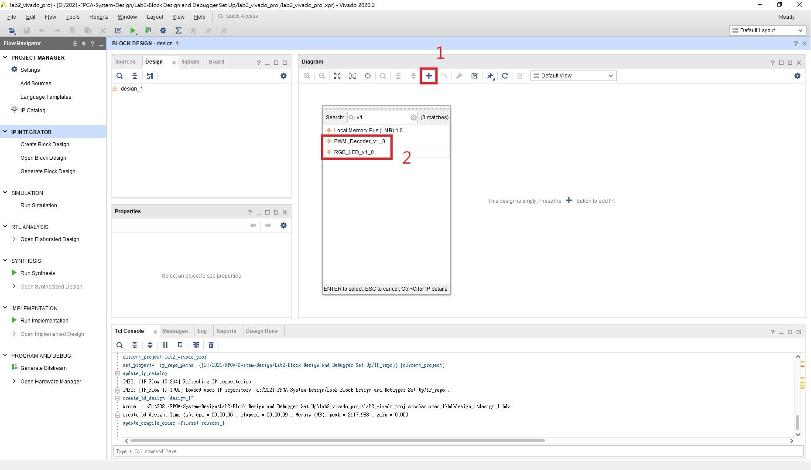

加入成功後 Block Design 應該會長的如下圖

接著要幫電路接線，設定 I/O Ports  
在空白處 `右鍵` -> `Create Port`，製作以下 Ports

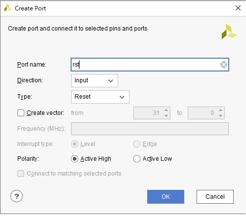

請照這個命名格式一樣製作 `G_out`、`B_out` 的 Ports

製作完 Ports 後 Block Design 應該會長的如下圖

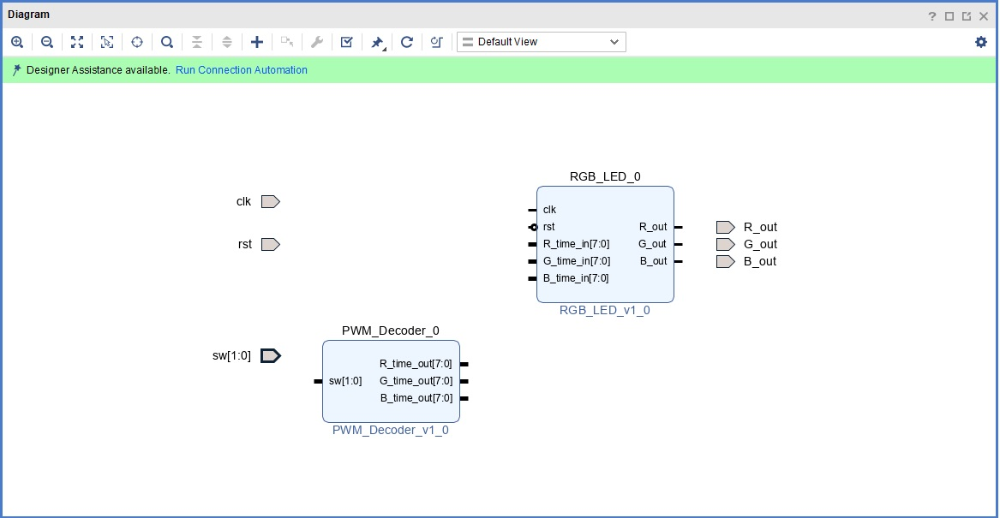

接著使用滑鼠左鍵點選後連接，將系統連接如下圖  
(上方的迴轉鍵可以幫你自動排列 Block Design 使其更加美觀)

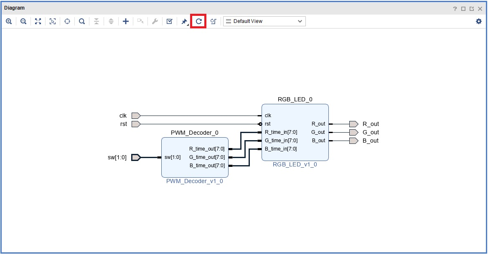

接者按下上方打勾的圖案，做 Block Design 初步的驗證

驗證沒問題後，在左方 Design Sources 內的 block design 項目按右鍵，選擇 `Create HDL Wrapper`  
這一步會生成一個 Block design 的 top-level HDL file

轉換完成後加入 `/xdc/pynq-z2_v1.0.xdc` 到 project 中

接著即可執行 `Synthesis` -> `Implementation` -> `Generate Bitstream`  
**(直接按下 `Generate Bitstream` 其實也會把前面兩步驟都一起做完)**

然後將 Bitstream file 燒錄進 FPGA。

------

# Part 3 - Set Up Debugger (硬體偵錯)

## Purpose

學習如何設置 Debugger 以觀察電路內訊號

## 3-1 使用 IP Catalog 中的 Integrated Logic Analyzer(ILA)

Vivado 有提供 ILA 的 IP core 供使用者進行硬體的 Debug，這裡我們用 block design 的方法來做示範  

沿用 Part2 的 Project，假設我們要觀察 RGB LED 給出的三個 Output、以及 PWM_Decoder 的 sw 訊號  

我們點選 Diagram window 的 `+` 號來呼叫一個 ILA

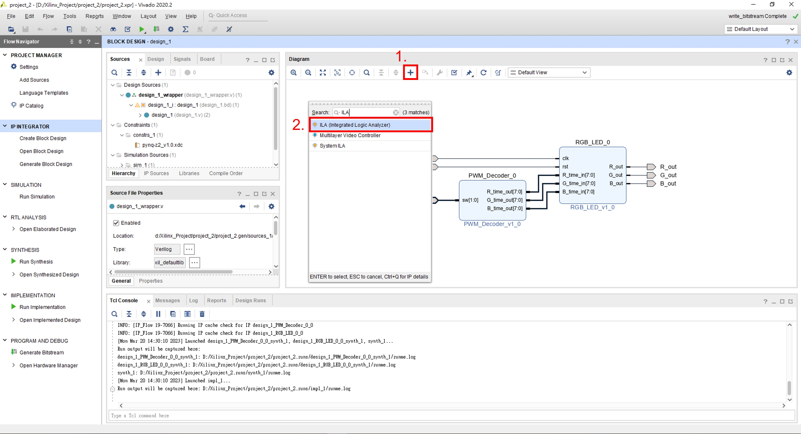

對 ILA block 點選兩下開啟 Re-customize IP window，然後根據以下步驟設定

接著將要觀察的訊號連接至 ILA，並按下打勾圖案，做 Block Design 初步的驗證

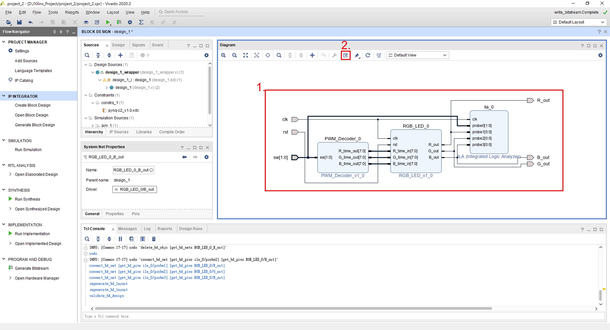

驗證沒問題後，在左方 Design Sources 內的 block design 項目按右鍵，選擇 `Create HDL Wrapper`  
然後執行 `Synthesis` -> `Implementation` -> `Generate Bitstream`  
並將 Bitstream file 燒錄進 FPGA  

燒錄完成後 Debug Probes 視窗將會開啟，若沒有的話請點選 `Window` > `Debug Probes`

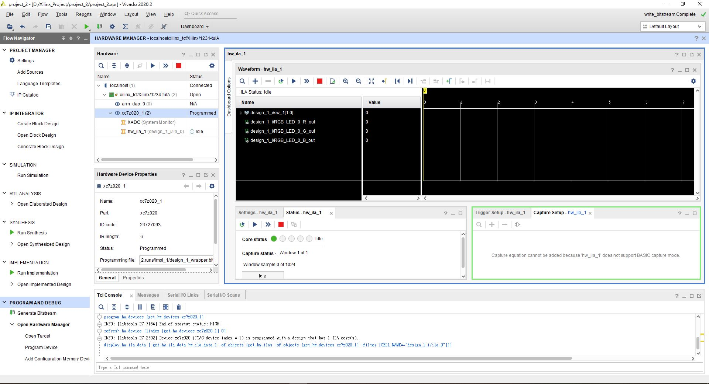

接著我們要設定 Trigger 條件，假設我們 Trigger 的條件為 `R_out == 1`  
在 Trigger Setup 的視窗點選 `+` 號將 R_out 訊號加入，然後對其做設定

可以在 Settings 視窗設定 Trigger 的位置、Window data depth等資訊

設定完成後，點選 Debug Probes 視窗上方的 run 鍵，即可看到波形

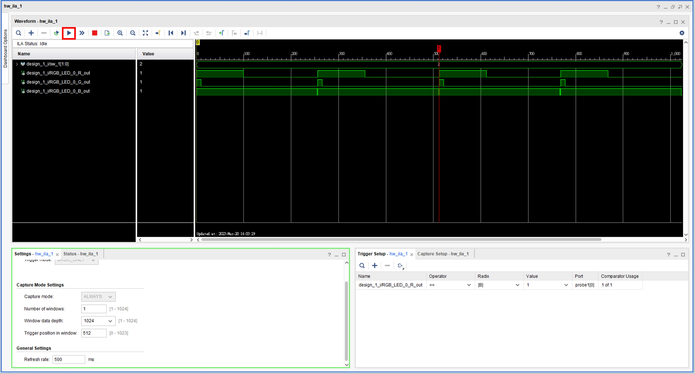

------
## 3-2 使用 Mark Debug

沿用 Part2 的 Project，假設我們要觀察 RGB LED 給出的三個 Output、以及 PWM_Decoder 的 sw 訊號  
將 block design 合成後，選擇左方列的 `SYNTHESIS` -> `Schematic`  

將 Schematic 中 `design_1` 左上角的 `+` 點開並找到我們要看的四條訊號線，  
按住 Ctrl 選擇這四條線使其變成藍色後，在其中一條線上按右鍵，點選 `Mark Debug`

按下左方工具列的 `Set Up Debug`

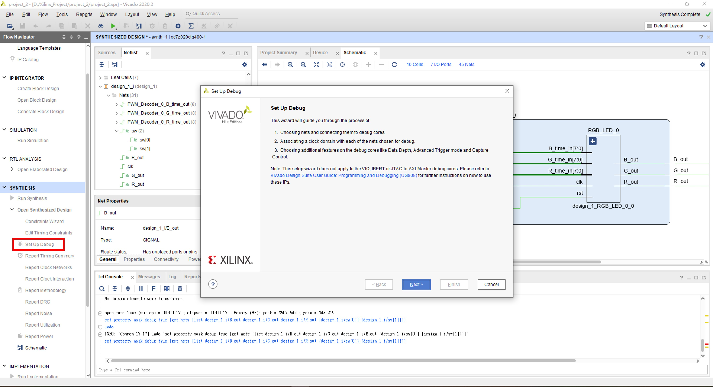

在 Clock Domain Undefined 的地方右鍵，選擇 `Select Clock Domain`

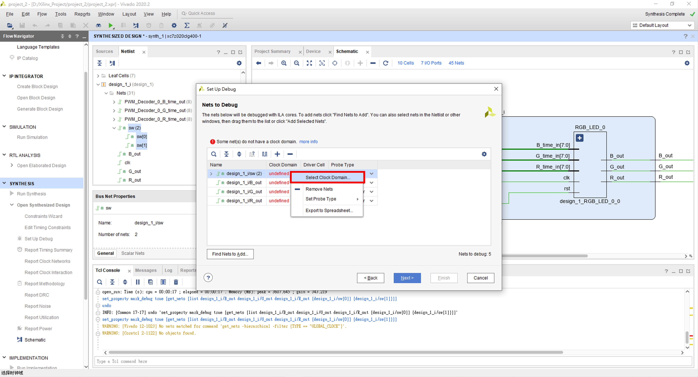

選擇 `clk_IBUF`

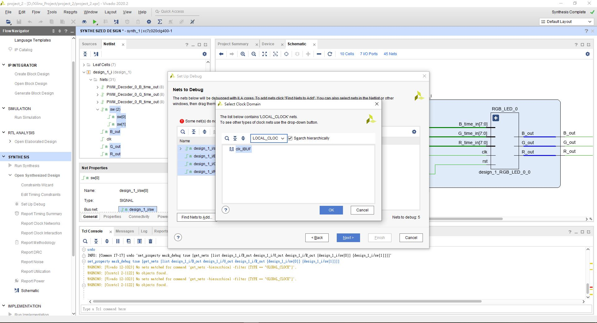

完成後如下圖

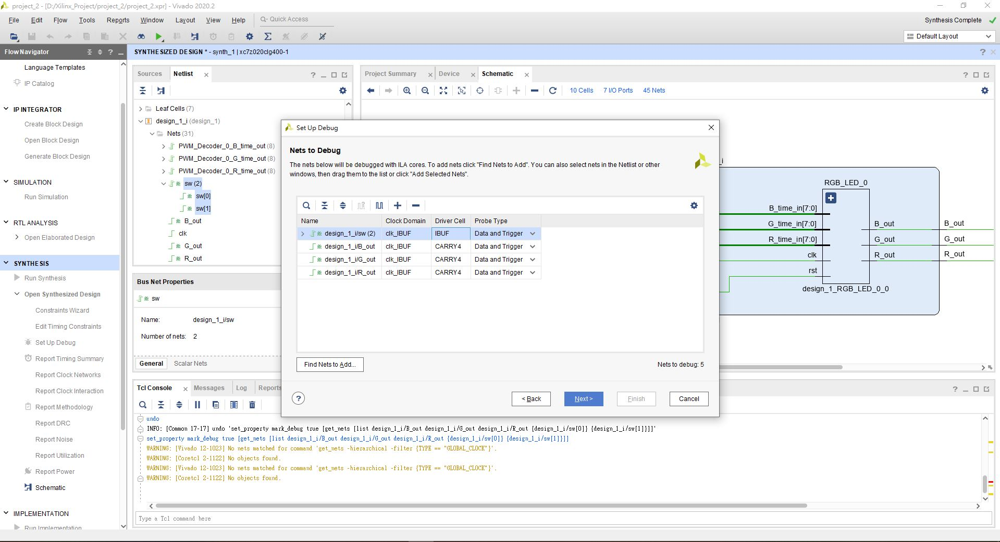

接著再重新 Synthesize 一次，再打開 Schematic 會發現多了兩個 Debug Blocks

Generate Bitstream，並燒錄到 FPGA 上  
接著跟 **Part3: 3-1** 一樣，設定完 Trigger 條件後，再按下畫面中的播放鍵，即可看到訊號的改變

